# FormEasy

A web app with whatsapp bot to ease the process of filling necessary forms like:

- Aadhar card
- PAN card
- Voter Id card etc.

## Demo Video

https://user-images.githubusercontent.com/27606753/133272618-0b832720-ac89-49a1-88d0-fd84de85fa25.mp4

<a href="https://formeasy.ravindrabosamiya.tech/">
<button>View Demo</button>
</a>

 

## Features

- Easy form filling using whatsApp
- Tracking form status
- Form info
- admin panel for aadhar card admin
- admin panel for PAN card admin
- admin panel for voterID card admin

## Admin functionality

- approve form
- reject form
- view approved list
- view rejected list
- view submitted list
- view all counts (total,submitted,rejected)

## Screenshots

 
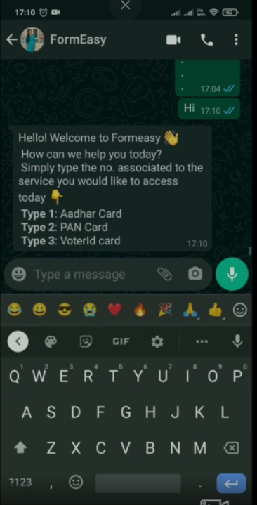

 Send hi to formEasy whatsApp no. 

 
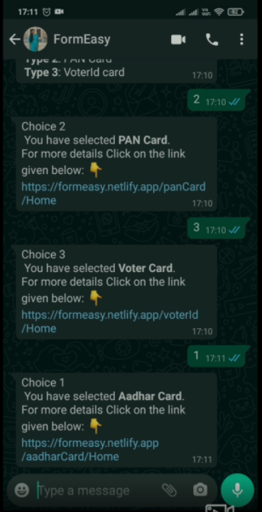
 

 Get link by typing desired form No

 
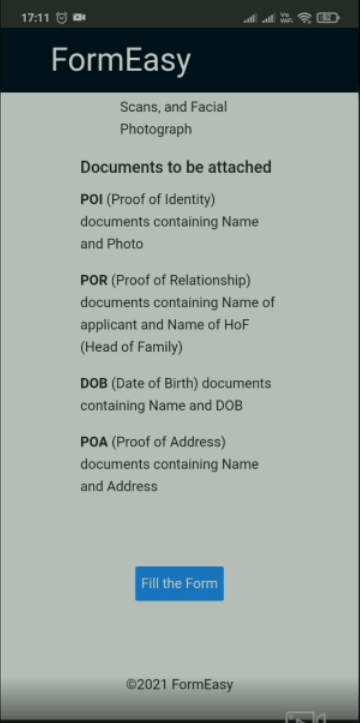
 

 Read about form Information and required documents

 
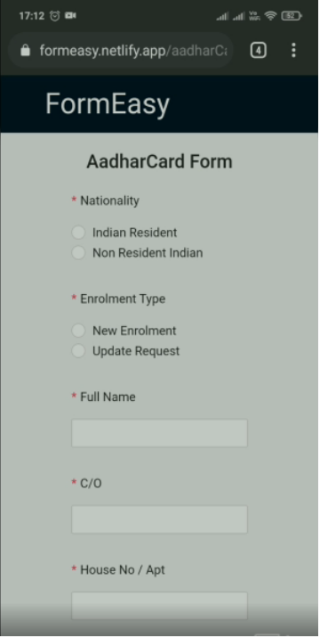
 

Fill the form 

 
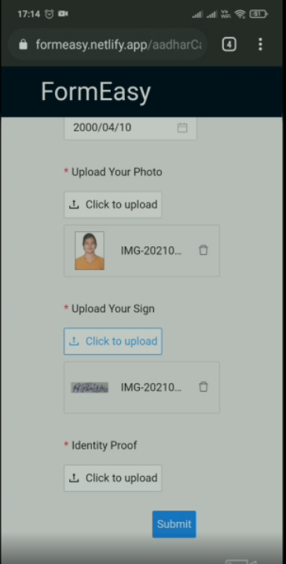
 

Upload docs required in form 

 
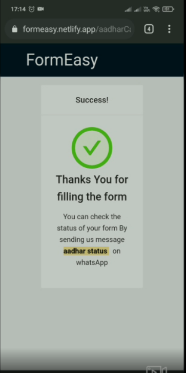
 

Form filled successfully  

 
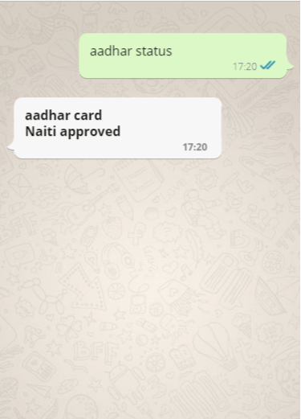
 

Track the status of your submitted form  

## Admin Area screenshots

 
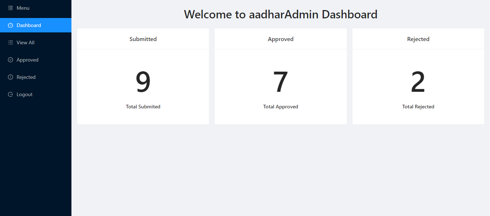
 

Admin Dahboard  

 
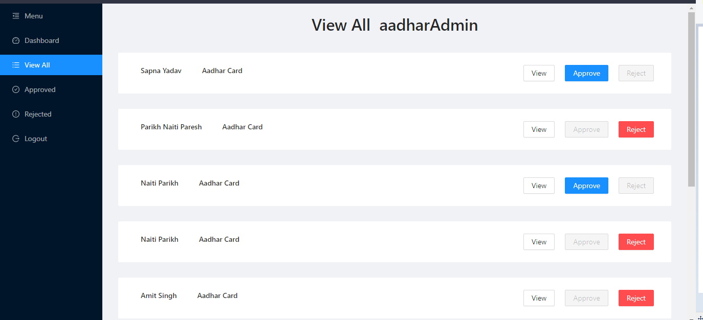
 

View All forms

 
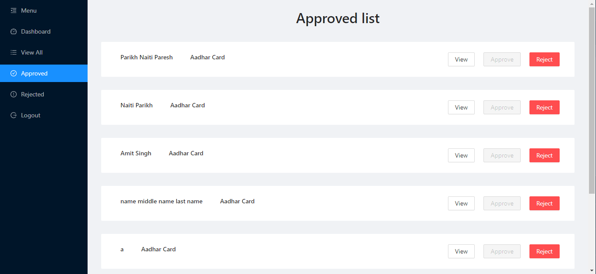
 

View Approved forms

 
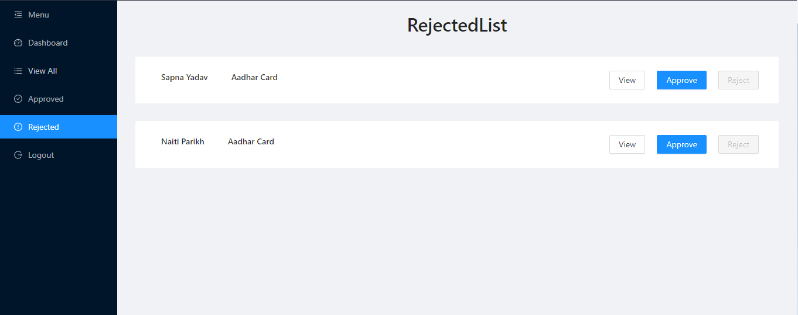
 

View Rejected forms  

### Contact me

<a href="mailto:rbosamiya9@gmail.com">
<button>Email</button>
</a>

<a href="https://api.whatsapp.com/send?phone=918866669219&text=Hey!">
<button>Chat</button>
</a>
